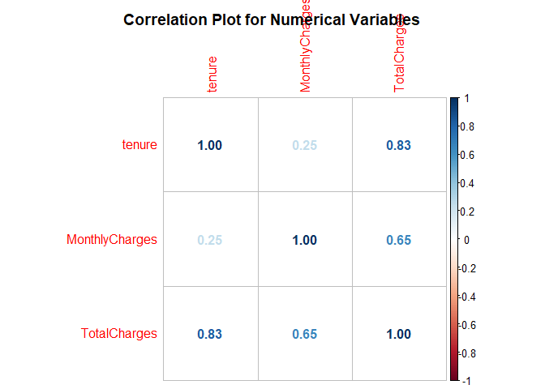

Telecom Churn Prediction
================
Kevin Huang

-   [Introduction](#introduction)
-   [Data Description](#data-description)
-   [Data Cleaning and Exploration](#data-cleaning-and-exploration)
-   [Data Exploration](#data-exploration)
    -   [What is the average tenure and charges based on
        gender?](#what-is-the-average-tenure-and-charges-based-on-gender)
    -   [What is the average tenure and charges for current and former
        customers?](#what-is-the-average-tenure-and-charges-for-current-and-former-customers)
    -   [Distribution Plots for Numerical
        Variables](#distribution-plots-for-numerical-variables)
    -   [Bar Plots for Categorical
        Variables](#bar-plots-for-categorical-variables)
    -   [Baseline Rate for Former customers (Positive = 1 : Former
        Customers
        )](#baseline-rate-for-former-customers-positive--1--former-customers-)
-   [Split Training and Testing data](#split-training-and-testing-data)
-   [Logistic Regression](#logistic-regression)
-   [Logistic regression - significant
    variables](#logistic-regression---significant-variables)
-   [Random forest](#random-forest)
-   [XGBoost](#xgboost)
-   [Conclusions](#conclusions)
-   [Data](#data)

## Introduction

Customer retention is an important aspect of businesses across many
sectors. When a customer leaves, it leads to a loss of revenue and more
time and resources needs to be spent to acquire new customers. Customer
churn is used to describe customers leaving a company and churn
prediction is a way to detect which customers are most likely to cancel
their subscription to a service. By being able to identify the customers
most likely to leave, a company can anticipate what actions to take to
convince the customer to stay. It is extremely important to understand
different customer preferences and behavior that might lead to their
cancellation. Churn prediction is also important in identifying at-risk
customers so that additional resources are not unnecessarily spent on
perfectly happy customers resulting in reduced revenue. In this project,
I will use exploratory data analysis to gain a deeper understanding on
the features in this data set and identify ones that would be helpful to
predicting churn. I will develop prediction models using multiple
methods and determine the most effective model for this data.

## Data Description

This Telecom data set provided by Kaggles has 7,043 records with 20
predictor variables and 1 binary response variable indicating whether or
not the customer left. There are 16 categorical and 4 numeric predictors
that contain various information about the customers and the type of
accounts they had with the company. Each row represents a customer.

-   Gender - gender of the account holder.

-   SeniorCitizen - binary variable that indicates if they were a senior
    citizen.

-   Partner - indicates whether they had a partner.

-   Dependent - indicates if they had other users on the account.

-   Tenure - how long they have been with the company in months.

-   PhoneService - indicates if the account signed up for phone
    services.

-   MultipleLines - indicates if the account signed up for multiple
    phone lines.

-   InternetService - indicates if the account signed up for internet
    services.

-   OnlineSecurity - indicates if the account signed up for online
    security.

-   OnlineBackup - indicates if the account signed up for online backup.

-   DeviceProtection - indicates if the account signed up for device
    protection.

-   TechSupport - indicates if the account signed up for tech support.

-   StreamingTV - indicates if the account signed up for streaming tv.

-   StreamingMovies - indicates if the account signed up for streaming
    moveies;

-   Contract - indicates the type of payment plan they signed up.

-   PaperlessBilling - indicates if the customer signed up for paperless
    billing.

-   PaymentMethod - indicates how the customer made their payments.

-   MonthlyCharges - amount the customer paid monthly for the services
    they signed up for.

-   TotalCharges - cumulative amount the customer has paid the company.

``` r
### Read data

data <- read.csv('WA_Fn-UseC_-Telco-Customer-Churn.csv')

glimpse(data)
```

    ## Rows: 7,043
    ## Columns: 21
    ## $ customerID       <chr> "7590-VHVEG", "5575-GNVDE", "3668-QPYBK", "7795-CFOCW…
    ## $ gender           <chr> "Female", "Male", "Male", "Male", "Female", "Female",…
    ## $ SeniorCitizen    <int> 0, 0, 0, 0, 0, 0, 0, 0, 0, 0, 0, 0, 0, 0, 0, 0, 0, 0,…
    ## $ Partner          <chr> "Yes", "No", "No", "No", "No", "No", "No", "No", "Yes…
    ## $ Dependents       <chr> "No", "No", "No", "No", "No", "No", "Yes", "No", "No"…
    ## $ tenure           <int> 1, 34, 2, 45, 2, 8, 22, 10, 28, 62, 13, 16, 58, 49, 2…
    ## $ PhoneService     <chr> "No", "Yes", "Yes", "No", "Yes", "Yes", "Yes", "No", …
    ## $ MultipleLines    <chr> "No phone service", "No", "No", "No phone service", "…
    ## $ InternetService  <chr> "DSL", "DSL", "DSL", "DSL", "Fiber optic", "Fiber opt…
    ## $ OnlineSecurity   <chr> "No", "Yes", "Yes", "Yes", "No", "No", "No", "Yes", "…
    ## $ OnlineBackup     <chr> "Yes", "No", "Yes", "No", "No", "No", "Yes", "No", "N…
    ## $ DeviceProtection <chr> "No", "Yes", "No", "Yes", "No", "Yes", "No", "No", "Y…
    ## $ TechSupport      <chr> "No", "No", "No", "Yes", "No", "No", "No", "No", "Yes…
    ## $ StreamingTV      <chr> "No", "No", "No", "No", "No", "Yes", "Yes", "No", "Ye…
    ## $ StreamingMovies  <chr> "No", "No", "No", "No", "No", "Yes", "No", "No", "Yes…
    ## $ Contract         <chr> "Month-to-month", "One year", "Month-to-month", "One …
    ## $ PaperlessBilling <chr> "Yes", "No", "Yes", "No", "Yes", "Yes", "Yes", "No", …
    ## $ PaymentMethod    <chr> "Electronic check", "Mailed check", "Mailed check", "…
    ## $ MonthlyCharges   <dbl> 29.85, 56.95, 53.85, 42.30, 70.70, 99.65, 89.10, 29.7…
    ## $ TotalCharges     <dbl> 29.85, 1889.50, 108.15, 1840.75, 151.65, 820.50, 1949…
    ## $ Churn            <chr> "No", "No", "Yes", "No", "Yes", "Yes", "No", "No", "Y…

# Data Cleaning and Exploration

In this section, I explore and clean the data. I begin by counting the
number of NAs in the entire data set. TotalCharges contained 11 NAs. I
decided to delete these records because they made up only 0.16% of the
available data. Other methods for filling in these missing values
include linear interpolation and statistical imputing (mean, median,
mode). I did not believe it was necessary because the remaining data was
still quite large. After removing the NAs, I looked at the number of
unique values in each predictor to get an idea of how many categories
there are in the categorical predictors. The categorical predictors were
then separated into their own dataframe, with the unique values listed
in each. I left out customerID because it is a unique identifier for
each customer and would not help with prediction decisions.

For the service related predictors such as OnlineSecurity, I noticed one
of the categories was “No internet service”. This essentially means the
same as having a “no” in that field, so I replaced those values with the
mutate function. To prepare for the model, I also converted the
character columns to factor type.

``` r
# Check NA counts in every column
colSums(is.na(data))
```

    ##       customerID           gender    SeniorCitizen          Partner 
    ##                0                0                0                0 
    ##       Dependents           tenure     PhoneService    MultipleLines 
    ##                0                0                0                0 
    ##  InternetService   OnlineSecurity     OnlineBackup DeviceProtection 
    ##                0                0                0                0 
    ##      TechSupport      StreamingTV  StreamingMovies         Contract 
    ##                0                0                0                0 
    ## PaperlessBilling    PaymentMethod   MonthlyCharges     TotalCharges 
    ##                0                0                0               11 
    ##            Churn 
    ##                0

``` r
# Remove records with NA's
data <- data[complete.cases(data),]

# Total number of unique values in each predictor
sapply(lapply(data, unique), length)
```

    ##       customerID           gender    SeniorCitizen          Partner 
    ##             7032                2                2                2 
    ##       Dependents           tenure     PhoneService    MultipleLines 
    ##                2               72                2                3 
    ##  InternetService   OnlineSecurity     OnlineBackup DeviceProtection 
    ##                3                3                3                3 
    ##      TechSupport      StreamingTV  StreamingMovies         Contract 
    ##                3                3                3                3 
    ## PaperlessBilling    PaymentMethod   MonthlyCharges     TotalCharges 
    ##                2                4             1584             6530 
    ##            Churn 
    ##                2

``` r
# Separate categorical predictors to explore separately
chr_vars <- data %>% 
  select_if(is.character) %>%
  select(-customerID)
lapply(chr_vars, unique)
```

    ## $gender
    ## [1] "Female" "Male"  
    ## 
    ## $Partner
    ## [1] "Yes" "No" 
    ## 
    ## $Dependents
    ## [1] "No"  "Yes"
    ## 
    ## $PhoneService
    ## [1] "No"  "Yes"
    ## 
    ## $MultipleLines
    ## [1] "No phone service" "No"               "Yes"             
    ## 
    ## $InternetService
    ## [1] "DSL"         "Fiber optic" "No"         
    ## 
    ## $OnlineSecurity
    ## [1] "No"                  "Yes"                 "No internet service"
    ## 
    ## $OnlineBackup
    ## [1] "Yes"                 "No"                  "No internet service"
    ## 
    ## $DeviceProtection
    ## [1] "No"                  "Yes"                 "No internet service"
    ## 
    ## $TechSupport
    ## [1] "No"                  "Yes"                 "No internet service"
    ## 
    ## $StreamingTV
    ## [1] "No"                  "Yes"                 "No internet service"
    ## 
    ## $StreamingMovies
    ## [1] "No"                  "Yes"                 "No internet service"
    ## 
    ## $Contract
    ## [1] "Month-to-month" "One year"       "Two year"      
    ## 
    ## $PaperlessBilling
    ## [1] "Yes" "No" 
    ## 
    ## $PaymentMethod
    ## [1] "Electronic check"          "Mailed check"             
    ## [3] "Bank transfer (automatic)" "Credit card (automatic)"  
    ## 
    ## $Churn
    ## [1] "No"  "Yes"

``` r
# Replace categories in columns where 'no service' has same meaning as 'no'
# Convert character columns to factor columns
data <- data %>%
     mutate(MultipleLines = case_when(MultipleLines== "No phone service"~ 'No', TRUE ~ MultipleLines)) %>%
     mutate(OnlineSecurity = case_when(OnlineSecurity== "No internet service"~ 'No', TRUE ~ OnlineSecurity)) %>%
     mutate(OnlineBackup = case_when(OnlineBackup== "No internet service"~ 'No', TRUE ~ OnlineBackup)) %>%
     mutate(DeviceProtection = case_when(DeviceProtection== "No internet service"~ 'No', TRUE ~ DeviceProtection)) %>%
     mutate(TechSupport = case_when(TechSupport== "No internet service"~ 'No', TRUE ~ TechSupport)) %>%
     mutate(StreamingTV = case_when(StreamingTV== "No internet service"~ 'No', TRUE ~ StreamingTV)) %>%
     mutate(StreamingMovies = case_when(StreamingMovies== "No internet service"~ 'No', TRUE ~ StreamingMovies)) %>%
     mutate(Churn = case_when(Churn== "No"~ '0', TRUE ~ '1')) %>%
     mutate_if(is.character, as.factor) %>%
     mutate(SeniorCitizen = factor(SeniorCitizen))

sapply(lapply(data, unique),length)
```

    ##       customerID           gender    SeniorCitizen          Partner 
    ##             7032                2                2                2 
    ##       Dependents           tenure     PhoneService    MultipleLines 
    ##                2               72                2                2 
    ##  InternetService   OnlineSecurity     OnlineBackup DeviceProtection 
    ##                3                2                2                2 
    ##      TechSupport      StreamingTV  StreamingMovies         Contract 
    ##                2                2                2                3 
    ## PaperlessBilling    PaymentMethod   MonthlyCharges     TotalCharges 
    ##                2                4             1584             6530 
    ##            Churn 
    ##                2

``` r
# Count of response variable Churn 
table(data$Churn)
```

    ## 
    ##    0    1 
    ## 5163 1869

# Data Exploration

In this section, we look at some basic statistics by gender and
current/former customers to get a sense of the average customer.

### What is the average tenure and charges based on gender?

``` r
data %>% 
  group_by(gender) %>% 
  rename("Gender" = gender) %>% 
  summarise("Number of Observations" = n(),
            "Average Tenure, in months" = round(mean(tenure), 0),
            "Monthly Charges" = round(mean(MonthlyCharges), 2),
            "Total Charges" = round(mean(TotalCharges), 2),
            across(Churn, list('0' = ~ sum(. == 0),
                         ' 1'  = ~ sum(. == 1)
            )))
```

    ## # A tibble: 2 × 7
    ##   Gender `Number of Observations` Average Tenu…¹ Month…² Total…³ Churn_0 Churn…⁴
    ##   <fct>                     <int>          <dbl>   <dbl>   <dbl>   <int>   <int>
    ## 1 Female                     3483             32    65.2   2283.    2544     939
    ## 2 Male                       3549             33    64.4   2283.    2619     930
    ## # … with abbreviated variable names ¹​`Average Tenure, in months`,
    ## #   ²​`Monthly Charges`, ³​`Total Charges`, ⁴​`Churn_ 1`

### What is the average tenure and charges for current and former customers?

``` r
data %>% 
  group_by(Churn) %>% 
  rename("Churn" = Churn) %>% 
  summarise("Number of Observations" = n(),
            "Average Tenure, in months" = round(mean(tenure), 0),
            "Monthly Charges" = round(mean(MonthlyCharges), 2),
            "Total Charges" = round(mean(TotalCharges), 2),
            across(gender, list(Male = ~ sum(. == "Male"),
                          Female  = ~ sum(. == "Female")
            )))
```

    ## # A tibble: 2 × 7
    ##   Churn `Number of Observations` Average Tenur…¹ Month…² Total…³ gende…⁴ gende…⁵
    ##   <fct>                    <int>           <dbl>   <dbl>   <dbl>   <int>   <int>
    ## 1 0                         5163              38    61.3   2555.    2619    2544
    ## 2 1                         1869              18    74.4   1532.     930     939
    ## # … with abbreviated variable names ¹​`Average Tenure, in months`,
    ## #   ²​`Monthly Charges`, ³​`Total Charges`, ⁴​gender_Male, ⁵​gender_Female

-   The data has 3483 Females and 3549 Males.
-   The average Tenure, in months for Females is 32.
-   The average Tenure, in months for Males is 33.
-   The average Monthly Charges for Females is 65.22.
-   The average Monthly Charges for Males is 64.39.
-   The average Total Charges for Females is 2283.19.
-   The average Total Charges for Males is 2283.41.

### Distribution Plots for Numerical Variables

``` r
data %>% 
  ggplot(aes(x = MonthlyCharges)) + 
  geom_histogram(bins = 20) +
  ggtitle('Distribution of MonthlyCharges') +
  geom_vline(aes(xintercept = mean(MonthlyCharges)), col = "red", linetype="dashed")+
  annotate(geom = "vline", label = 'Target line')
```

    ## Warning: `geom` must not be "vline".
    ## ℹ Please use `geom_vline()` directly instead.

    ## Warning in annotate(geom = "vline", label = "Target line"): Ignoring unknown
    ## parameters: `label`

``` r
data %>% 
  ggplot(aes(x = TotalCharges)) + 
  geom_histogram(bins = 20) +
  ggtitle('Distribution of TotalCharges') +
  geom_vline(aes(xintercept = mean(TotalCharges)), col = "red", linetype="dashed")
```


Looking at the correlation matrix for the numerical predictors, I notice
that MonthlyCharges and TotalCharges appear to be relatively highly
correlated. TotalCharges appears to be highly correlated with
MonthlyCharges as well as tenure. I will leave these variables in the
data for the time being and decide which to remove later when building
the logistic regression model.

``` r
# Correlation Matrix to see if multicollinearity exists between numeric variables
num_var <- data %>%
  select_if(is.numeric)
corr.matrix <- cor(num_var)
corrplot(corr.matrix, main="\n\nCorrelation Plot for Numerical Variables", method="number")
```

<!-- -->

### Bar Plots for Categorical Variables

``` r
par(mar = c(4, 4, .1, .1))
# Looking into the response variable
# Count of Yes/No's in Churn
# Bar Plot for Churn
data %>% 
  ggplot(aes(x = Churn, fill = Churn)) +
  geom_bar() + 
  ggtitle('Count of Churn') +
  geom_text(stat='count', aes(label=..count..), vjust=1)  
```

    ## Warning: The dot-dot notation (`..count..`) was deprecated in ggplot2 3.4.0.
    ## ℹ Please use `after_stat(count)` instead.

``` r
data %>% 
  ggplot(aes(x = gender, fill = gender)) +
  geom_bar() + 
  ggtitle('Count of gender') +
  geom_text(stat='count', aes(label=..count..), vjust=1)  

data %>% 
  ggplot(aes(x = Partner, fill = Partner)) +
  geom_bar() + 
  ggtitle('Count of Partner') +
  geom_text(stat='count', aes(label=..count..), vjust=1)  

data %>% 
  ggplot(aes(x = Dependents, fill = Dependents)) +
  geom_bar() + 
  ggtitle('Count of Dependents') +
  geom_text(stat='count', aes(label=..count..), vjust=1)  
```


### Baseline Rate for Former customers (Positive = 1 : Former Customers )

The baseline rate for this project is calculated by dividing the total
number of churn = 1 by the number of churn = 0. This is to establish a
baseline against which my models can be compared. The goal is to create
a model that outperforms the current baseline rate. If a model’s
prediction is not better than the baseline rate, using the baseline rate
for predictions is simpler and less expensive.

``` r
count_churn <- count(data, Churn)
baseline_rate = count_churn$n[2]/(count_churn$n[1] + count_churn$n[2])

baseline_rate
```

    ## [1] 0.265785

# Split Training and Testing data

I begin by building the logistic regression model. I removed the
customerID because it is a unique identifier that is not a feature of
the response variable. I split 80% of the data to use for training the
model and reserve 20% for testing the model.

``` r
# Set seed
set.seed(109)

cleaned_data <- data %>% dplyr::select(-c(customerID))

str(cleaned_data)
```

    ## 'data.frame':    7032 obs. of  20 variables:
    ##  $ gender          : Factor w/ 2 levels "Female","Male": 1 2 2 2 1 1 2 1 1 2 ...
    ##  $ SeniorCitizen   : Factor w/ 2 levels "0","1": 1 1 1 1 1 1 1 1 1 1 ...
    ##  $ Partner         : Factor w/ 2 levels "No","Yes": 2 1 1 1 1 1 1 1 2 1 ...
    ##  $ Dependents      : Factor w/ 2 levels "No","Yes": 1 1 1 1 1 1 2 1 1 2 ...
    ##  $ tenure          : int  1 34 2 45 2 8 22 10 28 62 ...
    ##  $ PhoneService    : Factor w/ 2 levels "No","Yes": 1 2 2 1 2 2 2 1 2 2 ...
    ##  $ MultipleLines   : Factor w/ 2 levels "No","Yes": 1 1 1 1 1 2 2 1 2 1 ...
    ##  $ InternetService : Factor w/ 3 levels "DSL","Fiber optic",..: 1 1 1 1 2 2 2 1 2 1 ...
    ##  $ OnlineSecurity  : Factor w/ 2 levels "No","Yes": 1 2 2 2 1 1 1 2 1 2 ...
    ##  $ OnlineBackup    : Factor w/ 2 levels "No","Yes": 2 1 2 1 1 1 2 1 1 2 ...
    ##  $ DeviceProtection: Factor w/ 2 levels "No","Yes": 1 2 1 2 1 2 1 1 2 1 ...
    ##  $ TechSupport     : Factor w/ 2 levels "No","Yes": 1 1 1 2 1 1 1 1 2 1 ...
    ##  $ StreamingTV     : Factor w/ 2 levels "No","Yes": 1 1 1 1 1 2 2 1 2 1 ...
    ##  $ StreamingMovies : Factor w/ 2 levels "No","Yes": 1 1 1 1 1 2 1 1 2 1 ...
    ##  $ Contract        : Factor w/ 3 levels "Month-to-month",..: 1 2 1 2 1 1 1 1 1 2 ...
    ##  $ PaperlessBilling: Factor w/ 2 levels "No","Yes": 2 1 2 1 2 2 2 1 2 1 ...
    ##  $ PaymentMethod   : Factor w/ 4 levels "Bank transfer (automatic)",..: 3 4 4 1 3 3 2 4 3 1 ...
    ##  $ MonthlyCharges  : num  29.9 57 53.9 42.3 70.7 ...
    ##  $ TotalCharges    : num  29.9 1889.5 108.2 1840.8 151.7 ...
    ##  $ Churn           : Factor w/ 2 levels "0","1": 1 1 2 1 2 2 1 1 2 1 ...

``` r
# Split train and test data
ind <- sample(2, nrow(cleaned_data), replace = T, prob = c(0.8, 0.2))
train <- cleaned_data[ind == 1,]
test <- cleaned_data[ind == 2,]
```

# Logistic Regression

I begin with a logistic regression model that takes into account all
variables. Looking at the logistic regression summary results, I notice
that MonthlyCharges is not a significant variable to the response
variable. The logistic regression null hypothesis states that there is
no relationship between the response variable and the predictor
variable. The alternative hypothesis holds that there is a connection.
We will reject the alternate hypothesis and conclude that there is no
relationship between MonthlyCharges and the response variable because
the p-value for MonthlyCharges is significant at.206, which is greater
than 0.05 for the 95% confidence interval. My next step will be to
examine the model’s Variance Inflation Factor. The VIF is a
multicollinearity measure in a set of multiple regression variables. The
ideal VIF number would be less than 10, indicating that there is little
multicollinearity between the variables. Variables with high
multicollinearity are those that are highly related to another variable
and can be achieved with just one of them. MonthlyCharges has a high VIF
number here of 26.459. MonthlyCharges was removed from the model, and
the remaining predictors were used to predict on the training and
testing data. Using this model to predict on the training data, we get
an accuracy of 0.7448, sensitivity of 0.8257, and specificity of 0.7162.
The area under the curve is 84.9%. Using this model to predict on the
testing data, we get an accuracy of 0.7481, sensitivity of 0.8228, and
specificity of 0.7185.

I perform a stepwise AIC on the model to determine which predictors are
not adding much value to the model. Because the AIC is a predictor of
error, the lower the AIC score, the better the model. The stepwiseAIC
identifies and compares all possible stepwise removals of a term from
the model. The final model suggested after running the stepwise AIC is
with predictors SeniorCitizen, Dependents, tenure, PhoneService,
MultipleLines, InternetService, OnlineSecurity, OnlineBackup,
TechSupport, StreamingTV, StreamingMovies, Contract, PaperlessBilling,
PaymentMethod, and TotalCharges.

I test the final model by predicting on the training data itself using
only significant variables. We get an accuracy of 0.7326, sensitivity of
0.8353, and specificity of 0.6963 when we use the final model to predict
on the training data. The percentage of the area under the curve is
84.4%. We get an accuracy of 0.7357, sensitivity of 0.8301, and
specificity of 0.6984 when we use the final model to predict on the
testing data. Because the model’s accuracy on the training and testing
data was similar, I concluded that overfitting and underfitting are
unlikely to be an issue here.

The final model’s result with only significant variables was not what I
expected. The accuracy decreased from 0.7448 to 0.7326 on the training
data and from 0.7481 to 0.7357 on the testing data when compared to the
model with all variables included.

    ## 
    ## Attaching package: 'MASS'

    ## The following object is masked from 'package:dplyr':
    ## 
    ##     select

``` r
# Logistic regression
m <- glm(Churn~. , data = train, family = 'binomial' )
summary(m)
```

    ## 
    ## Call:
    ## glm(formula = Churn ~ ., family = "binomial", data = train)
    ## 
    ## Deviance Residuals: 
    ##     Min       1Q   Median       3Q      Max  
    ## -1.8057  -0.6713  -0.2825   0.6901   3.2434  
    ## 
    ## Coefficients:
    ##                                        Estimate Std. Error z value Pr(>|z|)    
    ## (Intercept)                           1.372e+00  9.219e-01   1.488  0.13672    
    ## genderMale                           -3.353e-02  7.330e-02  -0.457  0.64742    
    ## SeniorCitizen1                        2.633e-01  9.596e-02   2.744  0.00607 ** 
    ## PartnerYes                           -3.282e-02  8.800e-02  -0.373  0.70915    
    ## DependentsYes                        -2.174e-01  1.015e-01  -2.141  0.03225 *  
    ## tenure                               -5.974e-02  6.980e-03  -8.558  < 2e-16 ***
    ## PhoneServiceYes                       1.974e-01  7.355e-01   0.268  0.78843    
    ## MultipleLinesYes                      5.342e-01  2.016e-01   2.650  0.00805 ** 
    ## InternetServiceFiber optic            1.859e+00  9.025e-01   2.059  0.03946 *  
    ## InternetServiceNo                    -1.876e+00  9.145e-01  -2.052  0.04019 *  
    ## OnlineSecurityYes                    -1.313e-01  2.014e-01  -0.652  0.51461    
    ## OnlineBackupYes                       5.194e-02  1.982e-01   0.262  0.79332    
    ## DeviceProtectionYes                   1.428e-01  1.995e-01   0.716  0.47398    
    ## TechSupportYes                       -1.331e-01  2.043e-01  -0.651  0.51487    
    ## StreamingTVYes                        6.584e-01  3.702e-01   1.778  0.07535 .  
    ## StreamingMoviesYes                    6.719e-01  3.702e-01   1.815  0.06955 .  
    ## ContractOne year                     -7.016e-01  1.222e-01  -5.743 9.29e-09 ***
    ## ContractTwo year                     -1.377e+00  2.012e-01  -6.844 7.72e-12 ***
    ## PaperlessBillingYes                   3.407e-01  8.382e-02   4.065 4.81e-05 ***
    ## PaymentMethodCredit card (automatic) -1.484e-01  1.302e-01  -1.140  0.25444    
    ## PaymentMethodElectronic check         2.895e-01  1.069e-01   2.708  0.00676 ** 
    ## PaymentMethodMailed check            -1.306e-01  1.302e-01  -1.003  0.31589    
    ## MonthlyCharges                       -4.546e-02  3.595e-02  -1.264  0.20608    
    ## TotalCharges                          3.122e-04  7.952e-05   3.927 8.61e-05 ***
    ## ---
    ## Signif. codes:  0 '***' 0.001 '**' 0.01 '*' 0.05 '.' 0.1 ' ' 1
    ## 
    ## (Dispersion parameter for binomial family taken to be 1)
    ## 
    ##     Null deviance: 6407.6  on 5578  degrees of freedom
    ## Residual deviance: 4568.2  on 5555  degrees of freedom
    ## AIC: 4616.2
    ## 
    ## Number of Fisher Scoring iterations: 6

``` r
# Check VIF values
vif(m)
```

    ##                        GVIF Df GVIF^(1/(2*Df))
    ## gender             1.004297  1        1.002146
    ## SeniorCitizen      1.132600  1        1.064237
    ## Partner            1.376620  1        1.173295
    ## Dependents         1.280443  1        1.131566
    ## tenure            15.252795  1        3.905483
    ## PhoneService      36.259146  1        6.021557
    ## MultipleLines      7.433607  1        2.726464
    ## InternetService  387.203876  2        4.435932
    ## OnlineSecurity     5.090855  1        2.256292
    ## OnlineBackup       6.358352  1        2.521577
    ## DeviceProtection   6.436779  1        2.537081
    ## TechSupport        5.270912  1        2.295847
    ## StreamingTV       24.895090  1        4.989498
    ## StreamingMovies   24.897086  1        4.989698
    ## Contract           1.549281  2        1.115662
    ## PaperlessBilling   1.124688  1        1.060513
    ## PaymentMethod      1.358644  3        1.052408
    ## MonthlyCharges   700.099477  1       26.459393
    ## TotalCharges      19.810213  1        4.450867

``` r
m_aic <- stepAIC(m, direction = "both", trace = F)
summary(m_aic)
```

    ## 
    ## Call:
    ## glm(formula = Churn ~ SeniorCitizen + Dependents + tenure + MultipleLines + 
    ##     InternetService + OnlineSecurity + TechSupport + StreamingTV + 
    ##     StreamingMovies + Contract + PaperlessBilling + PaymentMethod + 
    ##     MonthlyCharges + TotalCharges, family = "binomial", data = train)
    ## 
    ## Deviance Residuals: 
    ##     Min       1Q   Median       3Q      Max  
    ## -1.8167  -0.6715  -0.2837   0.6866   3.2475  
    ## 
    ## Coefficients:
    ##                                        Estimate Std. Error z value Pr(>|z|)    
    ## (Intercept)                           1.035e+00  3.152e-01   3.282  0.00103 ** 
    ## SeniorCitizen1                        2.615e-01  9.525e-02   2.745  0.00605 ** 
    ## DependentsYes                        -2.336e-01  9.187e-02  -2.543  0.01099 *  
    ## tenure                               -5.975e-02  6.949e-03  -8.598  < 2e-16 ***
    ## MultipleLinesYes                      4.674e-01  9.965e-02   4.690 2.73e-06 ***
    ## InternetServiceFiber optic            1.549e+00  2.169e-01   7.139 9.37e-13 ***
    ## InternetServiceNo                    -1.603e+00  2.006e-01  -7.992 1.33e-15 ***
    ## OnlineSecurityYes                    -1.922e-01  1.006e-01  -1.910  0.05609 .  
    ## TechSupportYes                       -1.905e-01  1.029e-01  -1.851  0.06421 .  
    ## StreamingTVYes                        5.489e-01  1.103e-01   4.975 6.54e-07 ***
    ## StreamingMoviesYes                    5.619e-01  1.091e-01   5.150 2.61e-07 ***
    ## ContractOne year                     -6.933e-01  1.217e-01  -5.695 1.23e-08 ***
    ## ContractTwo year                     -1.364e+00  2.009e-01  -6.790 1.12e-11 ***
    ## PaperlessBillingYes                   3.405e-01  8.373e-02   4.067 4.76e-05 ***
    ## PaymentMethodCredit card (automatic) -1.473e-01  1.302e-01  -1.132  0.25781    
    ## PaymentMethodElectronic check         2.880e-01  1.068e-01   2.696  0.00702 ** 
    ## PaymentMethodMailed check            -1.308e-01  1.301e-01  -1.005  0.31489    
    ## MonthlyCharges                       -3.353e-02  6.524e-03  -5.139 2.76e-07 ***
    ## TotalCharges                          3.143e-04  7.924e-05   3.966 7.30e-05 ***
    ## ---
    ## Signif. codes:  0 '***' 0.001 '**' 0.01 '*' 0.05 '.' 0.1 ' ' 1
    ## 
    ## (Dispersion parameter for binomial family taken to be 1)
    ## 
    ##     Null deviance: 6407.6  on 5578  degrees of freedom
    ## Residual deviance: 4569.6  on 5560  degrees of freedom
    ## AIC: 4607.6
    ## 
    ## Number of Fisher Scoring iterations: 6

``` r
m_aic
```

    ## 
    ## Call:  glm(formula = Churn ~ SeniorCitizen + Dependents + tenure + MultipleLines + 
    ##     InternetService + OnlineSecurity + TechSupport + StreamingTV + 
    ##     StreamingMovies + Contract + PaperlessBilling + PaymentMethod + 
    ##     MonthlyCharges + TotalCharges, family = "binomial", data = train)
    ## 
    ## Coefficients:
    ##                          (Intercept)                        SeniorCitizen1  
    ##                            1.0346046                             0.2614809  
    ##                        DependentsYes                                tenure  
    ##                           -0.2336416                            -0.0597487  
    ##                     MultipleLinesYes            InternetServiceFiber optic  
    ##                            0.4673702                             1.5487850  
    ##                    InternetServiceNo                     OnlineSecurityYes  
    ##                           -1.6029209                            -0.1922014  
    ##                       TechSupportYes                        StreamingTVYes  
    ##                           -0.1904697                             0.5488702  
    ##                   StreamingMoviesYes                      ContractOne year  
    ##                            0.5619388                            -0.6933436  
    ##                     ContractTwo year                   PaperlessBillingYes  
    ##                           -1.3638558                             0.3405480  
    ## PaymentMethodCredit card (automatic)         PaymentMethodElectronic check  
    ##                           -0.1472855                             0.2879540  
    ##            PaymentMethodMailed check                        MonthlyCharges  
    ##                           -0.1307604                            -0.0335304  
    ##                         TotalCharges  
    ##                            0.0003143  
    ## 
    ## Degrees of Freedom: 5578 Total (i.e. Null);  5560 Residual
    ## Null Deviance:       6408 
    ## Residual Deviance: 4570  AIC: 4608

``` r
# Remove MonthlyCharges with VIF 26.46
train <- train %>% dplyr::select(-c(MonthlyCharges))
test <- test %>% dplyr::select(-c(MonthlyCharges))


# Logistic regression
m <- glm(Churn~. , data = train, family = 'binomial' )
summary(m)
```

    ## 
    ## Call:
    ## glm(formula = Churn ~ ., family = "binomial", data = train)
    ## 
    ## Deviance Residuals: 
    ##     Min       1Q   Median       3Q      Max  
    ## -1.7914  -0.6695  -0.2817   0.6927   3.2740  
    ## 
    ## Coefficients:
    ##                                        Estimate Std. Error z value Pr(>|z|)    
    ## (Intercept)                           2.322e-01  1.938e-01   1.198 0.230867    
    ## genderMale                           -3.508e-02  7.329e-02  -0.479 0.632205    
    ## SeniorCitizen1                        2.618e-01  9.594e-02   2.729 0.006360 ** 
    ## PartnerYes                           -2.998e-02  8.795e-02  -0.341 0.733191    
    ## DependentsYes                        -2.170e-01  1.015e-01  -2.138 0.032482 *  
    ## tenure                               -5.929e-02  6.957e-03  -8.523  < 2e-16 ***
    ## PhoneServiceYes                      -7.132e-01  1.502e-01  -4.747 2.06e-06 ***
    ## MultipleLinesYes                      3.066e-01  9.055e-02   3.386 0.000709 ***
    ## InternetServiceFiber optic            7.266e-01  1.116e-01   6.512 7.44e-11 ***
    ## InternetServiceNo                    -7.369e-01  1.560e-01  -4.722 2.33e-06 ***
    ## OnlineSecurityYes                    -3.558e-01  9.535e-02  -3.731 0.000190 ***
    ## OnlineBackupYes                      -1.729e-01  8.783e-02  -1.968 0.049059 *  
    ## DeviceProtectionYes                  -8.269e-02  8.940e-02  -0.925 0.354967    
    ## TechSupportYes                       -3.605e-01  9.715e-02  -3.711 0.000207 ***
    ## StreamingTVYes                        2.054e-01  9.278e-02   2.214 0.026845 *  
    ## StreamingMoviesYes                    2.186e-01  9.209e-02   2.374 0.017586 *  
    ## ContractOne year                     -7.056e-01  1.221e-01  -5.777 7.60e-09 ***
    ## ContractTwo year                     -1.377e+00  2.013e-01  -6.841 7.86e-12 ***
    ## PaperlessBillingYes                   3.423e-01  8.380e-02   4.085 4.40e-05 ***
    ## PaymentMethodCredit card (automatic) -1.486e-01  1.302e-01  -1.141 0.253829    
    ## PaymentMethodElectronic check         2.878e-01  1.069e-01   2.693 0.007074 ** 
    ## PaymentMethodMailed check            -1.297e-01  1.302e-01  -0.997 0.318989    
    ## TotalCharges                          3.070e-04  7.925e-05   3.874 0.000107 ***
    ## ---
    ## Signif. codes:  0 '***' 0.001 '**' 0.01 '*' 0.05 '.' 0.1 ' ' 1
    ## 
    ## (Dispersion parameter for binomial family taken to be 1)
    ## 
    ##     Null deviance: 6407.6  on 5578  degrees of freedom
    ## Residual deviance: 4569.8  on 5556  degrees of freedom
    ## AIC: 4615.8
    ## 
    ## Number of Fisher Scoring iterations: 6

``` r
# Check VIF values
vif(m)
```

    ##                       GVIF Df GVIF^(1/(2*Df))
    ## gender            1.004017  1        1.002006
    ## SeniorCitizen     1.132493  1        1.064186
    ## Partner           1.375390  1        1.172770
    ## Dependents        1.280364  1        1.131532
    ## tenure           15.147422  1        3.891969
    ## PhoneService      1.514993  1        1.230851
    ## MultipleLines     1.500228  1        1.224838
    ## InternetService   2.683531  2        1.279902
    ## OnlineSecurity    1.142065  1        1.068674
    ## OnlineBackup      1.247843  1        1.117069
    ## DeviceProtection  1.292993  1        1.137099
    ## TechSupport       1.192106  1        1.091836
    ## StreamingTV       1.563442  1        1.250377
    ## StreamingMovies   1.540733  1        1.241263
    ## Contract          1.549116  2        1.115632
    ## PaperlessBilling  1.124320  1        1.060340
    ## PaymentMethod     1.358313  3        1.052366
    ## TotalCharges     19.678812  1        4.436081

``` r
m_aic <- stepAIC(m, direction = "both", trace = F)
summary(m_aic)
```

    ## 
    ## Call:
    ## glm(formula = Churn ~ SeniorCitizen + Dependents + tenure + PhoneService + 
    ##     MultipleLines + InternetService + OnlineSecurity + OnlineBackup + 
    ##     TechSupport + StreamingTV + StreamingMovies + Contract + 
    ##     PaperlessBilling + PaymentMethod + TotalCharges, family = "binomial", 
    ##     data = train)
    ## 
    ## Deviance Residuals: 
    ##     Min       1Q   Median       3Q      Max  
    ## -1.8012  -0.6721  -0.2814   0.6920   3.2779  
    ## 
    ## Coefficients:
    ##                                        Estimate Std. Error z value Pr(>|z|)    
    ## (Intercept)                           1.894e-01  1.882e-01   1.006 0.314236    
    ## SeniorCitizen1                        2.579e-01  9.529e-02   2.706 0.006800 ** 
    ## DependentsYes                        -2.328e-01  9.188e-02  -2.534 0.011275 *  
    ## tenure                               -5.908e-02  6.916e-03  -8.543  < 2e-16 ***
    ## PhoneServiceYes                      -7.071e-01  1.500e-01  -4.715 2.41e-06 ***
    ## MultipleLinesYes                      3.093e-01  9.047e-02   3.418 0.000630 ***
    ## InternetServiceFiber optic            7.276e-01  1.115e-01   6.528 6.68e-11 ***
    ## InternetServiceNo                    -7.220e-01  1.553e-01  -4.649 3.34e-06 ***
    ## OnlineSecurityYes                    -3.534e-01  9.527e-02  -3.709 0.000208 ***
    ## OnlineBackupYes                      -1.714e-01  8.776e-02  -1.954 0.050744 .  
    ## TechSupportYes                       -3.624e-01  9.711e-02  -3.732 0.000190 ***
    ## StreamingTVYes                        1.978e-01  9.239e-02   2.141 0.032248 *  
    ## StreamingMoviesYes                    2.136e-01  9.180e-02   2.326 0.019995 *  
    ## ContractOne year                     -7.158e-01  1.216e-01  -5.884 3.99e-09 ***
    ## ContractTwo year                     -1.386e+00  2.008e-01  -6.901 5.18e-12 ***
    ## PaperlessBillingYes                   3.440e-01  8.376e-02   4.107 4.00e-05 ***
    ## PaymentMethodCredit card (automatic) -1.494e-01  1.302e-01  -1.147 0.251271    
    ## PaymentMethodElectronic check         2.897e-01  1.068e-01   2.712 0.006685 ** 
    ## PaymentMethodMailed check            -1.282e-01  1.301e-01  -0.985 0.324422    
    ## TotalCharges                          2.972e-04  7.856e-05   3.784 0.000154 ***
    ## ---
    ## Signif. codes:  0 '***' 0.001 '**' 0.01 '*' 0.05 '.' 0.1 ' ' 1
    ## 
    ## (Dispersion parameter for binomial family taken to be 1)
    ## 
    ##     Null deviance: 6407.6  on 5578  degrees of freedom
    ## Residual deviance: 4571.0  on 5559  degrees of freedom
    ## AIC: 4611
    ## 
    ## Number of Fisher Scoring iterations: 6

``` r
m_aic
```

    ## 
    ## Call:  glm(formula = Churn ~ SeniorCitizen + Dependents + tenure + PhoneService + 
    ##     MultipleLines + InternetService + OnlineSecurity + OnlineBackup + 
    ##     TechSupport + StreamingTV + StreamingMovies + Contract + 
    ##     PaperlessBilling + PaymentMethod + TotalCharges, family = "binomial", 
    ##     data = train)
    ## 
    ## Coefficients:
    ##                          (Intercept)                        SeniorCitizen1  
    ##                            0.1894395                             0.2579122  
    ##                        DependentsYes                                tenure  
    ##                           -0.2328247                            -0.0590802  
    ##                      PhoneServiceYes                      MultipleLinesYes  
    ##                           -0.7070848                             0.3092725  
    ##           InternetServiceFiber optic                     InternetServiceNo  
    ##                            0.7275700                            -0.7219618  
    ##                    OnlineSecurityYes                       OnlineBackupYes  
    ##                           -0.3533820                            -0.1714472  
    ##                       TechSupportYes                        StreamingTVYes  
    ##                           -0.3623914                             0.1978332  
    ##                   StreamingMoviesYes                      ContractOne year  
    ##                            0.2135699                            -0.7158213  
    ##                     ContractTwo year                   PaperlessBillingYes  
    ##                           -1.3859463                             0.3440322  
    ## PaymentMethodCredit card (automatic)         PaymentMethodElectronic check  
    ##                           -0.1493816                             0.2896923  
    ##            PaymentMethodMailed check                          TotalCharges  
    ##                           -0.1282071                             0.0002972  
    ## 
    ## Degrees of Freedom: 5578 Total (i.e. Null);  5559 Residual
    ## Null Deviance:       6408 
    ## Residual Deviance: 4571  AIC: 4611

``` r
detach("package:MASS", unload=TRUE)
```

    ## Warning: 'MASS' namespace cannot be unloaded:
    ##   namespace 'MASS' is imported by 'vcd', 'ipred' so cannot be unloaded

``` r
p1 <- predict(m, type = 'response')
r <- multiclass.roc(train$Churn, p1, percent = TRUE)
```

    ## Setting direction: controls < cases

``` r
roc <- r[['rocs']]
r1 <- roc[[1]]

plot.roc(r1,
         col = 'red',
         lwd = 5,
         main = 'ROC Curve for Telecom Data',
         print.auc = T,
         auc.polygon = T,
         grid = c(0.1, 0.2),
         grid.col = c('green', 'red'),
         max.auc.polygon = T,
         auc.polygon.col = 'lightblue',
         print.thres = T)
```

<!-- -->

``` r
auc(r1)
```

    ## Area under the curve: 84.91%

``` r
cutoff <- coords(r1, "best", ret = "threshold", transpose = FALSE)$threshold
cutoff
```

    ## [1] 0.24755

``` r
pred1 <- ifelse(p1>cutoff, 1, 0)
conf <- table(Predicted = pred1, Actual = train$Churn)
conf
```

    ##          Actual
    ## Predicted    0    1
    ##         0 2952  254
    ##         1 1170 1203

``` r
sensitivity(conf)
```

    ## [1] 0.7161572

``` r
specificity(conf)
```

    ## [1] 0.8256692

``` r
cm <- confusionMatrix(factor(pred1), factor(train$Churn), positive = '1')
cm
```

    ## Confusion Matrix and Statistics
    ## 
    ##           Reference
    ## Prediction    0    1
    ##          0 2952  254
    ##          1 1170 1203
    ##                                           
    ##                Accuracy : 0.7448          
    ##                  95% CI : (0.7331, 0.7562)
    ##     No Information Rate : 0.7388          
    ##     P-Value [Acc > NIR] : 0.161           
    ##                                           
    ##                   Kappa : 0.4503          
    ##                                           
    ##  Mcnemar's Test P-Value : <2e-16          
    ##                                           
    ##             Sensitivity : 0.8257          
    ##             Specificity : 0.7162          
    ##          Pos Pred Value : 0.5070          
    ##          Neg Pred Value : 0.9208          
    ##              Prevalence : 0.2612          
    ##          Detection Rate : 0.2156          
    ##    Detection Prevalence : 0.4253          
    ##       Balanced Accuracy : 0.7709          
    ##                                           
    ##        'Positive' Class : 1               
    ## 

``` r
# Predictions - test data (Accuracy = 70.66%, Misclassification = 29.33%)
p1_test <- predict(m, test, type = 'response')

r <- multiclass.roc(test$Churn, p1_test, percent = TRUE)
```

    ## Setting direction: controls < cases

``` r
roc <- r[['rocs']]
r1 <- roc[[1]]


pred2 <- ifelse(p1_test > cutoff ,1, 0)
table(Predicted = pred2, Actual = test$Churn)
```

    ##          Actual
    ## Predicted   0   1
    ##         0 748  73
    ##         1 293 339

``` r
cm1 <- confusionMatrix(factor(pred2), factor(test$Churn), positive = '1')
cm1
```

    ## Confusion Matrix and Statistics
    ## 
    ##           Reference
    ## Prediction   0   1
    ##          0 748  73
    ##          1 293 339
    ##                                          
    ##                Accuracy : 0.7481         
    ##                  95% CI : (0.725, 0.7703)
    ##     No Information Rate : 0.7164         
    ##     P-Value [Acc > NIR] : 0.003732       
    ##                                          
    ##                   Kappa : 0.4662         
    ##                                          
    ##  Mcnemar's Test P-Value : < 2.2e-16      
    ##                                          
    ##             Sensitivity : 0.8228         
    ##             Specificity : 0.7185         
    ##          Pos Pred Value : 0.5364         
    ##          Neg Pred Value : 0.9111         
    ##              Prevalence : 0.2836         
    ##          Detection Rate : 0.2333         
    ##    Detection Prevalence : 0.4350         
    ##       Balanced Accuracy : 0.7707         
    ##                                          
    ##        'Positive' Class : 1              
    ## 

# Logistic regression - significant variables

``` r
data_sig <- cleaned_data %>%
  select( c(SeniorCitizen,
          Dependents,
          tenure,
          MultipleLines,
          InternetService,
          StreamingTV,
          StreamingMovies,
          Contract,
          PaperlessBilling,
          PaymentMethod,
          TotalCharges,
          Churn))

# Set seed
set.seed(109)

# Split train and test data
ind <- sample(2, nrow(data_sig), replace = T, prob = c(0.8, 0.2))
train <- data_sig[ind == 1,]
test <- data_sig[ind == 2,]

# Logistic regression
m2 <- glm(Churn~. , data = train, family = 'binomial' )
summary(m2)
```

    ## 
    ## Call:
    ## glm(formula = Churn ~ ., family = "binomial", data = train)
    ## 
    ## Deviance Residuals: 
    ##     Min       1Q   Median       3Q      Max  
    ## -1.8317  -0.6724  -0.2934   0.6943   3.1142  
    ## 
    ## Coefficients:
    ##                                        Estimate Std. Error z value Pr(>|z|)    
    ## (Intercept)                          -6.378e-01  1.376e-01  -4.634 3.59e-06 ***
    ## SeniorCitizen1                        3.144e-01  9.465e-02   3.322 0.000894 ***
    ## DependentsYes                        -2.579e-01  9.127e-02  -2.826 0.004716 ** 
    ## tenure                               -4.679e-02  6.582e-03  -7.108 1.17e-12 ***
    ## MultipleLinesYes                      2.661e-01  8.766e-02   3.035 0.002403 ** 
    ## InternetServiceFiber optic            7.112e-01  1.002e-01   7.096 1.28e-12 ***
    ## InternetServiceNo                    -6.712e-01  1.408e-01  -4.766 1.88e-06 ***
    ## StreamingTVYes                        2.386e-01  9.109e-02   2.619 0.008818 ** 
    ## StreamingMoviesYes                    2.597e-01  9.040e-02   2.873 0.004064 ** 
    ## ContractOne year                     -7.984e-01  1.201e-01  -6.646 3.01e-11 ***
    ## ContractTwo year                     -1.541e+00  1.981e-01  -7.778 7.35e-15 ***
    ## PaperlessBillingYes                   3.538e-01  8.283e-02   4.271 1.95e-05 ***
    ## PaymentMethodCredit card (automatic) -1.439e-01  1.294e-01  -1.112 0.266029    
    ## PaymentMethodElectronic check         3.431e-01  1.060e-01   3.238 0.001204 ** 
    ## PaymentMethodMailed check            -1.161e-01  1.285e-01  -0.903 0.366484    
    ## TotalCharges                          1.152e-04  7.354e-05   1.567 0.117156    
    ## ---
    ## Signif. codes:  0 '***' 0.001 '**' 0.01 '*' 0.05 '.' 0.1 ' ' 1
    ## 
    ## (Dispersion parameter for binomial family taken to be 1)
    ## 
    ##     Null deviance: 6407.6  on 5578  degrees of freedom
    ## Residual deviance: 4627.3  on 5563  degrees of freedom
    ## AIC: 4659.3
    ## 
    ## Number of Fisher Scoring iterations: 6

``` r
# Check VIF values
vif(m2)
```

    ##                       GVIF Df GVIF^(1/(2*Df))
    ## SeniorCitizen     1.108594  1        1.052898
    ## Dependents        1.048217  1        1.023825
    ## tenure           13.455891  1        3.668227
    ## MultipleLines     1.421900  1        1.192435
    ## InternetService   1.981069  2        1.186383
    ## StreamingTV       1.518590  1        1.232311
    ## StreamingMovies   1.497940  1        1.223904
    ## Contract          1.491550  2        1.105120
    ## PaperlessBilling  1.115735  1        1.056284
    ## PaymentMethod     1.328736  3        1.048511
    ## TotalCharges     16.614064  1        4.076035

``` r
p2 <- predict(m2, type = 'response')
r <- multiclass.roc(train$Churn, p2, percent = TRUE)
```

    ## Setting direction: controls < cases

``` r
roc <- r[['rocs']]
r2 <- roc[[1]]

plot.roc(r2,
         col = 'red',
         lwd = 5,
         main = 'ROC Curve for Telecom Data',
         print.auc = T,
         auc.polygon = T,
         grid = c(0.1, 0.2),
         grid.col = c('green', 'red'),
         max.auc.polygon = T,
         auc.polygon.col = 'lightblue',
         print.thres = T)
```

<!-- -->

``` r
auc(r1)
```

    ## Area under the curve: 84.26%

``` r
cutoff <- coords(r2, "best", ret = "threshold", transpose = FALSE)$threshold
cutoff
```

    ## [1] 0.2297667

``` r
pred1 <- ifelse(p1>cutoff, 1, 0)
conf <- table(Predicted = pred1, Actual = train$Churn)
conf
```

    ##          Actual
    ## Predicted    0    1
    ##         0 2870  240
    ##         1 1252 1217

``` r
sensitivity(conf)
```

    ## [1] 0.6962639

``` r
specificity(conf)
```

    ## [1] 0.835278

``` r
cm <- confusionMatrix(factor(pred1), factor(train$Churn), positive = '1')
cm
```

    ## Confusion Matrix and Statistics
    ## 
    ##           Reference
    ## Prediction    0    1
    ##          0 2870  240
    ##          1 1252 1217
    ##                                           
    ##                Accuracy : 0.7326          
    ##                  95% CI : (0.7207, 0.7441)
    ##     No Information Rate : 0.7388          
    ##     P-Value [Acc > NIR] : 0.8603          
    ##                                           
    ##                   Kappa : 0.4341          
    ##                                           
    ##  Mcnemar's Test P-Value : <2e-16          
    ##                                           
    ##             Sensitivity : 0.8353          
    ##             Specificity : 0.6963          
    ##          Pos Pred Value : 0.4929          
    ##          Neg Pred Value : 0.9228          
    ##              Prevalence : 0.2612          
    ##          Detection Rate : 0.2181          
    ##    Detection Prevalence : 0.4426          
    ##       Balanced Accuracy : 0.7658          
    ##                                           
    ##        'Positive' Class : 1               
    ## 

``` r
# Predictions - test data (Accuracy = 70.66%, Misclassification = 29.33%)
p1_test <- predict(m2, test, type = 'response')

r <- multiclass.roc(test$Churn, p1_test, percent = TRUE)
```

    ## Setting direction: controls < cases

``` r
roc <- r[['rocs']]
r1 <- roc[[1]]


pred2 <- ifelse(p1_test > cutoff ,1, 0)
table(Predicted = pred2, Actual = test$Churn)
```

    ##          Actual
    ## Predicted   0   1
    ##         0 727  70
    ##         1 314 342

``` r
cm1 <- confusionMatrix(factor(pred2), factor(test$Churn), positive = '1')
cm1
```

    ## Confusion Matrix and Statistics
    ## 
    ##           Reference
    ## Prediction   0   1
    ##          0 727  70
    ##          1 314 342
    ##                                           
    ##                Accuracy : 0.7357          
    ##                  95% CI : (0.7122, 0.7582)
    ##     No Information Rate : 0.7164          
    ##     P-Value [Acc > NIR] : 0.05397         
    ##                                           
    ##                   Kappa : 0.4483          
    ##                                           
    ##  Mcnemar's Test P-Value : < 2e-16         
    ##                                           
    ##             Sensitivity : 0.8301          
    ##             Specificity : 0.6984          
    ##          Pos Pred Value : 0.5213          
    ##          Neg Pred Value : 0.9122          
    ##              Prevalence : 0.2836          
    ##          Detection Rate : 0.2354          
    ##    Detection Prevalence : 0.4515          
    ##       Balanced Accuracy : 0.7642          
    ##                                           
    ##        'Positive' Class : 1               
    ## 

# Random forest

I begin by removing the customerID from the data for the random forest
model. I divide the data into 80% for training and 20% for testing. I
set the cvcontrol to repeat 5 folds twice. The random forest plot
reveals that the top five most important variables were tenure, total
charges, internet service, monthly charges, and tech support. Because
random forest models are non-parametric, they are unaffected by
multicollinearity between predictors, so I included all variables in the
model.

Using the random forest model to predict on the training data, we get an
accuracy of 0.8527 , sensitivity of 0.5669, and specificity of .9537.
Using the random forest model to predict on the testing data, we get an
accuracy of 0.7873 , sensitivity of 0.4466, and specificity of 0.9222.

``` r
# Set seed
set.seed(109)

cleaned_data <- data %>% dplyr::select(-c(customerID))

# Split train and test data
ind <- sample(2, nrow(cleaned_data), replace = T, prob = c(0.8, 0.2))
train <- cleaned_data[ind == 1,]
test <- cleaned_data[ind == 2,]


cvcontrol <- trainControl(method="repeatedcv",
                          number = 5,
                          repeats = 2,
                          allowParallel=TRUE)

# RF
forest <- train(Churn ~ . ,
             data=train,
             method="rf",
             trControl=cvcontrol,
             importance=TRUE)
plot(varImp(forest))
```

<!-- -->

``` r
p_rf_train <- predict(forest, train, type = 'raw')
confusionMatrix(p_rf_train, train$Churn, positive = '1')
```

    ## Confusion Matrix and Statistics
    ## 
    ##           Reference
    ## Prediction    0    1
    ##          0 3931  631
    ##          1  191  826
    ##                                           
    ##                Accuracy : 0.8527          
    ##                  95% CI : (0.8431, 0.8619)
    ##     No Information Rate : 0.7388          
    ##     P-Value [Acc > NIR] : < 2.2e-16       
    ##                                           
    ##                   Kappa : 0.5769          
    ##                                           
    ##  Mcnemar's Test P-Value : < 2.2e-16       
    ##                                           
    ##             Sensitivity : 0.5669          
    ##             Specificity : 0.9537          
    ##          Pos Pred Value : 0.8122          
    ##          Neg Pred Value : 0.8617          
    ##              Prevalence : 0.2612          
    ##          Detection Rate : 0.1481          
    ##    Detection Prevalence : 0.1823          
    ##       Balanced Accuracy : 0.7603          
    ##                                           
    ##        'Positive' Class : 1               
    ## 

``` r
p_rf <- predict(forest, test, type = 'raw')
confusionMatrix(p_rf, test$Churn, positive = '1')
```

    ## Confusion Matrix and Statistics
    ## 
    ##           Reference
    ## Prediction   0   1
    ##          0 960 228
    ##          1  81 184
    ##                                           
    ##                Accuracy : 0.7873          
    ##                  95% CI : (0.7654, 0.8081)
    ##     No Information Rate : 0.7164          
    ##     P-Value [Acc > NIR] : 4.244e-10       
    ##                                           
    ##                   Kappa : 0.4133          
    ##                                           
    ##  Mcnemar's Test P-Value : < 2.2e-16       
    ##                                           
    ##             Sensitivity : 0.4466          
    ##             Specificity : 0.9222          
    ##          Pos Pred Value : 0.6943          
    ##          Neg Pred Value : 0.8081          
    ##              Prevalence : 0.2836          
    ##          Detection Rate : 0.1266          
    ##    Detection Prevalence : 0.1824          
    ##       Balanced Accuracy : 0.6844          
    ##                                           
    ##        'Positive' Class : 1               
    ## 

# XGBoost

The XGBoost model operates similarly to random forest so I left all the
variables in the model except the customerID. An additional step I did
here was to one hot encode the categorical variables so the XGBoost
would run more smoothly. The XGBoost variable importance plot reveals
that the top five most important variables were Contract, tenure,
MonthlyCharges, TotalCharges, and InternetServices. Using the xgboost
model to predict on the training data, we get an accuracy of 0.8374 ,
sensitivity of 0.5923, and specificity of 0.9241. Using the xgboost
model to predict on the testing data, we get an accuracy of 0.7942 ,
sensitivity of 0.5316, and specificity of 0.8982.

``` r
# Set seed
set.seed(109)

# one hot encode - testing
cleaned_data <- data %>% dplyr::select(-c(customerID))

# separate vehicle_trim to not be hot coded
col_churn <- cleaned_data$Churn
df_for_encode <- cleaned_data %>% dplyr::select(-c(Churn))

df_encode <- one_hot(as.data.table(df_for_encode))

df_encode <- cbind(df_encode,col_churn) %>%
  rename(Churn = col_churn)

# Split train and test data
ind <- sample(2, nrow(df_encode), replace = T, prob = c(0.8, 0.2))
train <- df_encode[ind == 1,]
test <- df_encode[ind == 2,]

# Boosting
set.seed(109)
boo <- train(Churn ~ .,
             data=train,
             method="xgbTree",
             trControl=cvcontrol,
             tuneGrid = expand.grid(nrounds = 500,
                                    max_depth = 4,
                                    eta = 0.28,
                                    gamma = 1.8,
                                    colsample_bytree = 1,
                                    min_child_weight = 1,
                                    subsample = 1))
plot(varImp(boo))
```

<!-- -->

``` r
p_boo <- predict(boo, train, type = 'raw')
confusionMatrix(p_boo, train$Churn, positive = '1')
```

    ## Confusion Matrix and Statistics
    ## 
    ##           Reference
    ## Prediction    0    1
    ##          0 3809  594
    ##          1  313  863
    ##                                          
    ##                Accuracy : 0.8374         
    ##                  95% CI : (0.8275, 0.847)
    ##     No Information Rate : 0.7388         
    ##     P-Value [Acc > NIR] : < 2.2e-16      
    ##                                          
    ##                   Kappa : 0.5507         
    ##                                          
    ##  Mcnemar's Test P-Value : < 2.2e-16      
    ##                                          
    ##             Sensitivity : 0.5923         
    ##             Specificity : 0.9241         
    ##          Pos Pred Value : 0.7338         
    ##          Neg Pred Value : 0.8651         
    ##              Prevalence : 0.2612         
    ##          Detection Rate : 0.1547         
    ##    Detection Prevalence : 0.2108         
    ##       Balanced Accuracy : 0.7582         
    ##                                          
    ##        'Positive' Class : 1              
    ## 

``` r
p_boo <- predict(boo, test, type = 'raw')
confusionMatrix(p_boo, test$Churn, positive = '1')
```

    ## Confusion Matrix and Statistics
    ## 
    ##           Reference
    ## Prediction   0   1
    ##          0 935 193
    ##          1 106 219
    ##                                           
    ##                Accuracy : 0.7942          
    ##                  95% CI : (0.7725, 0.8147)
    ##     No Information Rate : 0.7164          
    ##     P-Value [Acc > NIR] : 7.064e-12       
    ##                                           
    ##                   Kappa : 0.459           
    ##                                           
    ##  Mcnemar's Test P-Value : 6.575e-07       
    ##                                           
    ##             Sensitivity : 0.5316          
    ##             Specificity : 0.8982          
    ##          Pos Pred Value : 0.6738          
    ##          Neg Pred Value : 0.8289          
    ##              Prevalence : 0.2836          
    ##          Detection Rate : 0.1507          
    ##    Detection Prevalence : 0.2237          
    ##       Balanced Accuracy : 0.7149          
    ##                                           
    ##        'Positive' Class : 1               
    ## 

# Conclusions

Below, I reiterate the results of each model on the testing data.

Using the regression model to predict on the testing data, we get an
accuracy of 0.7357, sensitivity of 0.8301, and specificity of 0.6984.

Using the random forest model to predict on the testing data, we get an
accuracy of 0.7873 , sensitivity of 0.4466, and specificity of 0.9222

Using the XGBoost model to predict on the testing data, we get an
accuracy of 0.7942 , sensitivity of 0.5316, and specificity of 0.8982.

According to the results, XGBoost has the highest accuracy in predicting
whether a customer will leave the company. The random forest model is
not far behind in accuracy and has the highest specificity. The xgboost
model is the one I would recommend to the company for overall churn
prediction. However, if the company is more concerned with predicting
true negatives, which in this case are customers staying, I would
recommend the random forest model because it has a higher specificity
and its accuracy is not far behind that of the xgboost model. Because
all three models outperformed the baseline rate, we can conclude that
using any of these three models to predict customer churn is preferable
to using the baseline rate.

Tenure, InternetService, and MonthlyCharges were among the most
important predictors used by all three models. A company that uses these
churn prediction models should focus and devote additional resources on
these areas to improve customer retention.

# Data

<https://www.kaggle.com/datasets/blastchar/telco-customer-churn>
